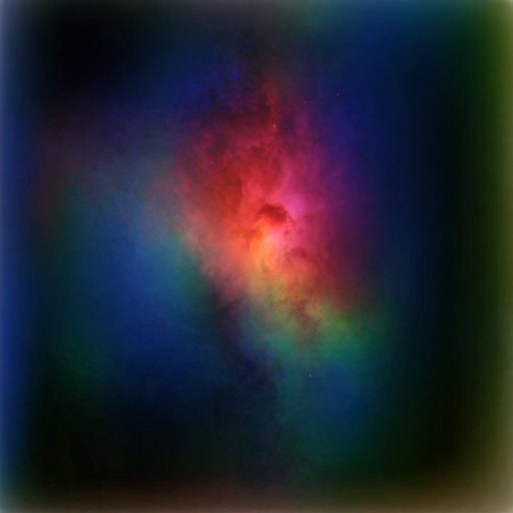

# Generative Adversarial Networks - Nebula Generator

## Overview

Recall from kindergarten or preschool, the very first drawing you ever made. Now compare it with any drawing you made recently. Big difference? Ok, but how? How did you learn to draw? How did you go from shaky lines and messy drawings to the absolute piece of art you make today?

Practice? Yes, lots of practice. But, there was another entity that helped you learn: Your Teacher.

Think about it, you make a drawing, and the question that arises is: Is it good enough? To you it may be, but is it something others would look at in awe?

So you take your drawing to your Art teacher. She gives you some feedback. And you learn something new. The process repeats until at some point, your teacher is absolutely awestruck. You might just be the next Pablo Picasso.

Now think of this process as a conversation between two parts:
1. The Generator, you, the one making the images
2. The Discriminator, your teacher, the one providing feedback.

You Make images, You send them to your teacher, Your teacher Gives feedback, you learn, and repeat.

Now, is it possible to train a program, to generate images in a similar way? To think about it, all you would need is something that produces images. And something that can classify images. A Generator, and A discriminator. So here’s what we do. Take two neural networks. Train one to Generate images and the other to classify them. This is what we call A Generative Adversarial Network or GAN for short.

This project implements a simple Generative Adversarial Network (GAN) model for generating nebula images using Python and TensorFlow. The model produces random nebula images based on the provided dataset.

## Dataset

The dataset used for training the GAN can be accessed here: [Nebula Images Dataset](https://www.kaggle.com/datasets/akhileshravi/nebula-images). It includes various images of nebulae, which were used to train and evaluate the GAN.

## Results

The GAN model generates random nebula images. Below are some sample images generated by the model. These images have been enhanced and sharpened using other AI tools.

## Results

The GAN model generates random nebula images. Below are some sample images generated by the model. These images have been enhanced and sharpened using other AI tools.

    
    
    
    

